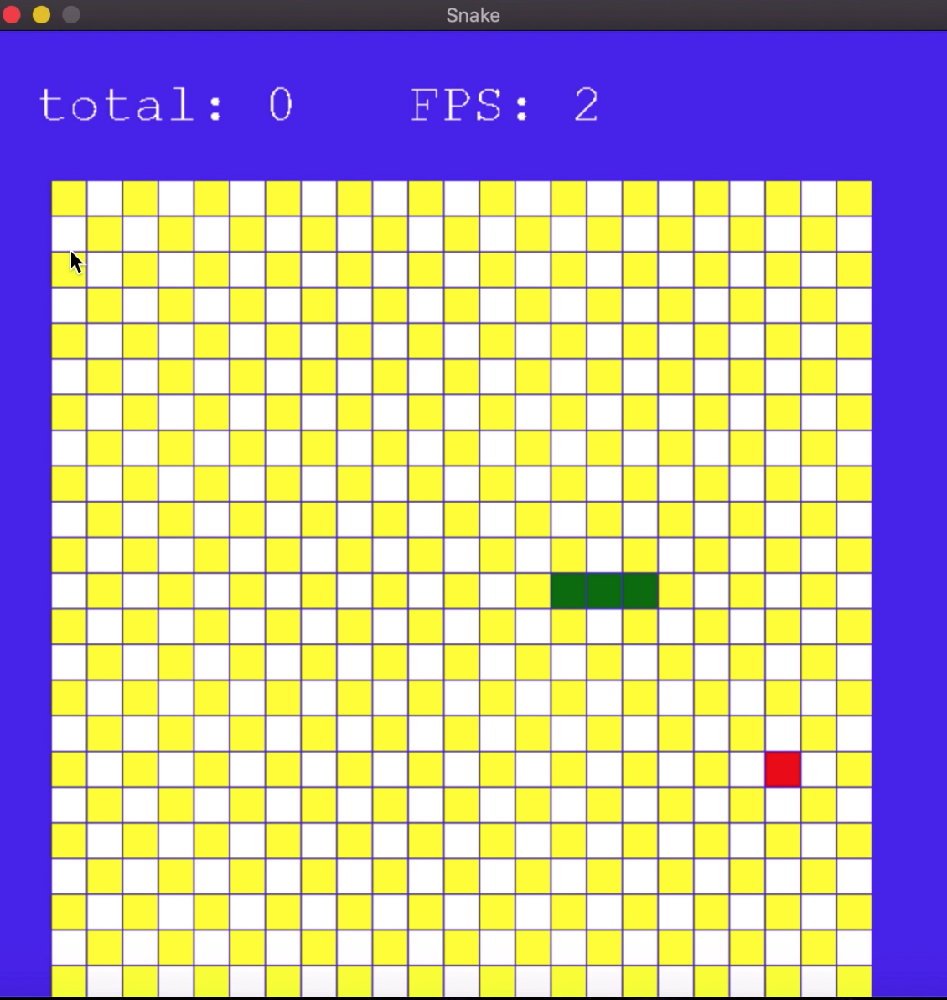

# Разработка игры "Змейка"

## Техническое задание

Создать игру "Змейка" с использованием Python и библиотеки Pygame для обучения программированию.

## Результаты работы

Результатом выполненной работы является игра "Змейка" на Python с использованием библиотеки Pygame. Игра позволяет игроку управлять змейкой, собирать пищу и набирать очки, избегая столкновений с границами игрового поля и самой собой. Игра обладает графическим интерфейсом и может быть успешно сыграна на компьютере.

## Требования

1. Создать окно игры:

   - Определить размер окна и его разрешение.
   - Установить фон и отображение игрового поля.

2. Создать объект "Змейка":

   - Определить начальное положение и длину змейки.
   - Обеспечить управление змейкой с помощью клавиш клавиатуры (вверх, вниз, влево, вправо).
3. Создать объект "Пища" (еда для змейки):

   - Определить случайное положение пищи на игровом поле.
   - Обеспечить механизм поедания пищи змейкой и увеличения ее длины.
4. Реализовать игровую логику:

   - Определить условия окончания игры, например, столкновение змейки с границами поля или самой собой.
   - Вести учет очков и отображать их на экране.
5. Организовать главный игровой цикл:

   - Обновлять положение и состояние змейки и пищи на каждом шаге цикла.
   - Обрабатывать пользовательский ввод.
   - Отображать текущее состояние игры на экране.

6. Протестировать игру:

   - Провести тестирование игры на наличие ошибок и неполадок.
   - Убедиться, что игра работает корректно и может быть успешно завершена.

